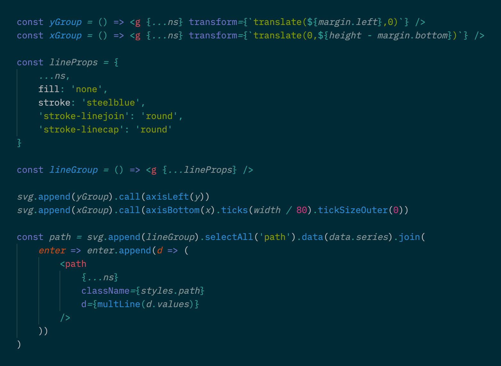

# *d3-activated*

__tldr__: *thinking with d3 like it's the new jquery*

The d3activated pattern uses [**d3-selection.join**](https://github.com/d3/d3-selection#selection_join) to bind data to DOM Elements created with [**JSX**](https://reactjs.org/docs/jsx-in-depth.html). The JSX is transpiled using [**jsx-pragma**](https://github.com/ScottORLY/jsx-dom).

d3activated can be used for data visualizations or to bind data to HTML Elements.

[**Demonstration**](https://scottorly.github.io/d3activated)

## Motivation

The most compelling thing about react was not the top down, double buffer, virtual dom diffing library but the discovery of JSX. A discovery comparable to Crockford's discovery of [**JSON**](https://json.org/).

JSX is great but what if you don't want to bootstrap a [videogame engine](https://twitter.com/acdlite/status/978696799757086720) to build a user interface?

[**D3**](https://d3js.org) has been the premier data visualization library for the web since it's release in 2011. Within it's famously verbose & oftentimes painful to follow syntax is a performant method of binding data to dom elements with a small footprint.

d3activated uses [**jsx-pragma**](https://github.com/ScottORLY/jsx-dom), a simple library used with [**babel**](https://babeljs.io) to transpile JSX to vanilla dom elements instead of react components. These elements are bound to data using d3-selection's data join api for building HTML UIs or data visualization.

## Data Visualization

d3activated can help clean up your d3 code a little.



The example code above is a port of [this example](https://observablehq.com/@d3/multi-line-chart) & can be found [here](src/multiline/index.js)


## Basic Data Binds

```javascript
import { select } from 'd3-selection'

const ul = (<ul />)

const update = data => {
    select('ul')
        .selectAll('li')
        .data(data, d => d)
        .join(
            enter => enter.append(d => <li>{d}</li>)
        )
}

document.body.appendChild(ul)

const data = ['36th Chamber of Shaolin', 'Clan of the White Lotus', 'Sleeping Fist', 'Dance of the Drunken Mantis']

update(data)
```

To update the bound data simply call the update function again with the updated data.

```javascript
data.unshift('Shaolin Executioner')
data.pop()

update(data)
```

For more about d3's general update pattern see https://observablehq.com/@d3/selection-join & [Thinking with Joins](https://bost.ocks.org/mike/join/).

## Setup

install

`npm i`

start dev server at http://localhost:8081/d3activated

`npm start`

build

`npm run dist`
